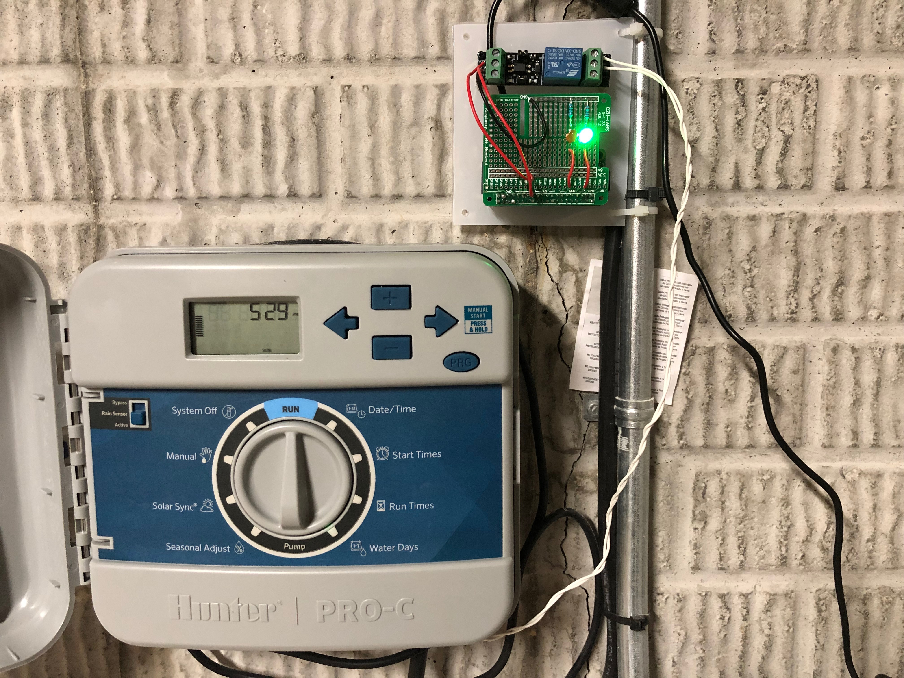
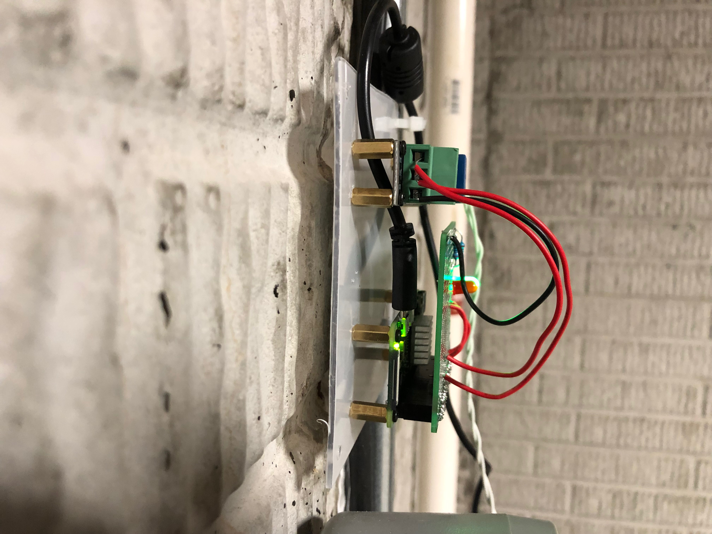

# Sprinkler-rain-bypass
This program is allows your Raspberry Pi to replace the rain bypass controller for your sprinkler system. It is written in Python 3.

This program started from http://www.thirdeyevis.com/pi-page-3.php by Scott Mangold. The original program was written for the weather underground
API and no longer works, as that API is no longer available. See Mr. Mangold's page for instructions. I made the following changes to his design:
- Changed weather API to Dark Sky
- Added Google Maps API to get Lat / Lon
- Simplified the hardware to incorporate a pre-assembled relay rather than building one from components
- Reduced the number of LEDs required
- Changed how the configuration file works
- General code optimizations

# Required parts and API access
- 1 Raspberry Pi with active internet connection and GPIO library installed (I used a Raspberry Pi Zero W and added GPIO Pins)
- 1 Raspberry Pi breakout board (many are available, you can also use a breadboard if you want a no solder option)
- 2 50-300 ohm resistors
- 1 single channel 3V relay module
- 1 Green led
- 1 Red led
- Irrigation controller with rain-bypass option
- Dark Sky developer API account (free)
- Google maps developer API account (free)

# Order of the program
- Open libraries and Config File
- Determine Lat/Lon from Google
- Get precip amount from DarkSky
- Set status
- Set GPIO Pins

# Images
Front View

Side View

